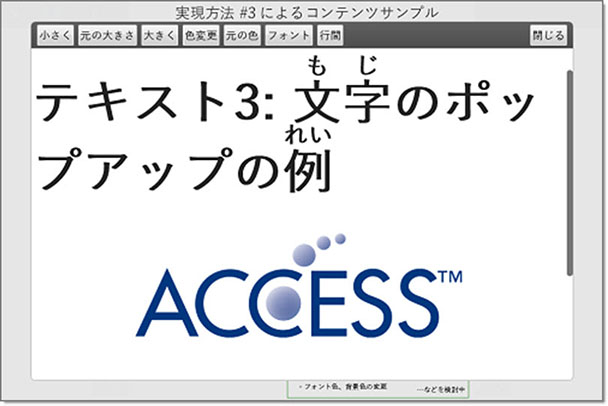

# 電子書籍コンテンツ制作手順書

Rev.2

2013/12/24

## 目次

* [はじめに](#はじめに)
	+ [概要](#概要)
	+ [コンテンツ制作環境について](#コンテンツ制作環境について)
		- [PCシステム構成](#PCシステム構成)
		- [Adobe InDesign, illustrator のバージョンについて](#Adobe InDesign, illustrator のバージョンについて)
		- [フォントについて](#フォントについて)
		- [スクリプト実行環境について](#スクリプト実行環境について)
* [Hybrid View 機能について](#Hybrid View 機能について)
* [サンプルコンテンツについて](#サンプルコンテンツについて)
* [コンテンツ制作フロー](#コンテンツ制作フロー)
* [Fixed Layout 型 EPUBコンテンツ制作手順](#Fixed Layout 型 EPUBコンテンツ制作手順)
* [Hybrid View 型 EPUBコンテンツ制作手順](#Hybrid View 型 EPUBコンテンツ制作手順)
* [変更履歴](#変更履歴)

## はじめに

### 概要									
本書は、Adobe InDesign, illustrator から、紙面同等の表現性を持たせた Fixed Layout 型 EPUBコンテンツの作成手順及び、コンテンツ作成上注意すべき修正箇所に関する情報を提示する。

セクション | 内容
:-------- | :-------
[サンプルコンテンツについて](#サンプルコンテンツについて) | サンプルコンテンツのフォルダ構成及び内容について示す。
[コンテンツ制作フローについて](#コンテンツ制作フロー) | Adobe Indesign, illustrator から Fixed Layout 型 EPUBコンテンツを制作する為のフローを示す。
[Fixed Layout 型コンテンツ制作手順について](#Fixed Layout 型 EPUBコンテンツ制作手順) | コンテンツ制作フローに記載された各ステップの制作手順、並びに、修正箇所を示す。
[Hybrid View 型コンテンツ制作手順について](#Hybrid View 型 EPUBコンテンツ制作手順) | コンテンツ制作フローに記載された各ステップの制作手順、並びに、修正箇所を示す。(Hybrid View 機能を有効にした場合)

# 電子書籍コンテンツ制作手順書

Rev.2

2013/12/24

## 目次

* [はじめに](#はじめに)
	+ [概要](#概要)
	+ [コンテンツ制作環境について](#コンテンツ制作環境について)
		- [PCシステム構成](#PCシステム構成)
		- [Adobe InDesign, illustrator のバージョンについて](#Adobe InDesign, illustrator のバージョンについて)
		- [フォントについて](#フォントについて)
		- [スクリプト実行環境について](#スクリプト実行環境について)
* [Hybrid View 機能について](#Hybrid View 機能について)
* [サンプルコンテンツについて](#サンプルコンテンツについて)
* [コンテンツ制作フロー](#コンテンツ制作フロー)
* [Fixed Layout 型 EPUBコンテンツ制作手順](#Fixed Layout 型 EPUBコンテンツ制作手順)
* [Hybrid View 型 EPUBコンテンツ制作手順](#Hybrid View 型 EPUBコンテンツ制作手順)
* [変更履歴](#変更履歴)

## はじめに

### 概要									
本書は、Adobe InDesign, illustrator から、紙面同等の表現性を持たせた Fixed Layout 型 EPUBコンテンツの作成手順及び、コンテンツ作成上注意すべき修正箇所に関する情報を提示する。

セクション | 内容
:-------- | :-------
[サンプルコンテンツについて](#サンプルコンテンツについて) | サンプルコンテンツのフォルダ構成及び内容について示す。
[コンテンツ制作フローについて](#コンテンツ制作フロー) | Adobe Indesign, illustrator から Fixed Layout 型 EPUBコンテンツを制作する為のフローを示す。
[Fixed Layout 型コンテンツ制作手順について](#Fixed Layout 型 EPUBコンテンツ制作手順) | コンテンツ制作フローに記載された各ステップの制作手順、並びに、修正箇所を示す。
[Hybrid View 型コンテンツ制作手順について](#Hybrid View 型 EPUBコンテンツ制作手順) | コンテンツ制作フローに記載された各ステップの制作手順、並びに、修正箇所を示す。(Hybrid View 機能を有効にした場合)

# 電子書籍コンテンツ制作手順書

Rev.2

2013/12/24

## 目次

* [はじめに](#はじめに)
	+ [概要](#概要)
	+ [コンテンツ制作環境について](#コンテンツ制作環境について)
		- [PCシステム構成](#PCシステム構成)
		- [Adobe InDesign, illustrator のバージョンについて](#Adobe InDesign, illustrator のバージョンについて)
		- [フォントについて](#フォントについて)
		- [スクリプト実行環境について](#スクリプト実行環境について)
* [Hybrid View 機能について](#Hybrid View 機能について)
* [サンプルコンテンツについて](#サンプルコンテンツについて)
* [コンテンツ制作フロー](#コンテンツ制作フロー)
* [Fixed Layout 型 EPUBコンテンツ制作手順](#Fixed Layout 型 EPUBコンテンツ制作手順)
* [Hybrid View 型 EPUBコンテンツ制作手順](#Hybrid View 型 EPUBコンテンツ制作手順)
* [変更履歴](#変更履歴)

## はじめに

### 概要									
本書は、Adobe InDesign, illustrator から、紙面同等の表現性を持たせた Fixed Layout 型 EPUBコンテンツの作成手順及び、コンテンツ作成上注意すべき修正箇所に関する情報を提示する。

セクション | 内容
:-------- | :-------
[サンプルコンテンツについて](#サンプルコンテンツについて) | サンプルコンテンツのフォルダ構成及び内容について示す。
[コンテンツ制作フローについて](#コンテンツ制作フロー) | Adobe Indesign, illustrator から Fixed Layout 型 EPUBコンテンツを制作する為のフローを示す。
[Fixed Layout 型コンテンツ制作手順について](#Fixed Layout 型 EPUBコンテンツ制作手順) | コンテンツ制作フローに記載された各ステップの制作手順、並びに、修正箇所を示す。
[Hybrid View 型コンテンツ制作手順について](#Hybrid View 型 EPUBコンテンツ制作手順) | コンテンツ制作フローに記載された各ステップの制作手順、並びに、修正箇所を示す。(Hybrid View 機能を有効にした場合)

# 電子書籍コンテンツ制作手順書

Rev.2

2013/12/24

## 目次

* [はじめに](#はじめに)
	+ [概要](#概要)
	+ [コンテンツ制作環境について](#コンテンツ制作環境について)
		- [PCシステム構成](#PCシステム構成)
		- [Adobe InDesign, illustrator のバージョンについて](#Adobe InDesign, illustrator のバージョンについて)
		- [フォントについて](#フォントについて)
		- [スクリプト実行環境について](#スクリプト実行環境について)
* [Hybrid View 機能について](#Hybrid View 機能について)
* [サンプルコンテンツについて](#サンプルコンテンツについて)
* [コンテンツ制作フロー](#コンテンツ制作フロー)
* [Fixed Layout 型 EPUBコンテンツ制作手順](#Fixed Layout 型 EPUBコンテンツ制作手順)
* [Hybrid View 型 EPUBコンテンツ制作手順](#Hybrid View 型 EPUBコンテンツ制作手順)
* [変更履歴](#変更履歴)

## はじめに

### 概要									
本書は、Adobe InDesign, illustrator から、紙面同等の表現性を持たせた Fixed Layout 型 EPUBコンテンツの作成手順及び、コンテンツ作成上注意すべき修正箇所に関する情報を提示する。

セクション | 内容
:-------- | :-------
[サンプルコンテンツについて](#サンプルコンテンツについて) | サンプルコンテンツのフォルダ構成及び内容について示す。
[コンテンツ制作フローについて](#コンテンツ制作フロー) | Adobe Indesign, illustrator から Fixed Layout 型 EPUBコンテンツを制作する為のフローを示す。
[Fixed Layout 型コンテンツ制作手順について](#Fixed Layout 型 EPUBコンテンツ制作手順) | コンテンツ制作フローに記載された各ステップの制作手順、並びに、修正箇所を示す。
[Hybrid View 型コンテンツ制作手順について](#Hybrid View 型 EPUBコンテンツ制作手順) | コンテンツ制作フローに記載された各ステップの制作手順、並びに、修正箇所を示す。(Hybrid View 機能を有効にした場合)

# 電子書籍コンテンツ制作手順書

Rev.2

2013/12/24

## 目次

* [はじめに](#はじめに)
	+ [概要](#概要)
	+ [コンテンツ制作環境について](#コンテンツ制作環境について)
		- [PCシステム構成](#PCシステム構成)
		- [Adobe InDesign, illustrator のバージョンについて](#Adobe InDesign, illustrator のバージョンについて)
		- [フォントについて](#フォントについて)
		- [スクリプト実行環境について](#スクリプト実行環境について)
* [Hybrid View 機能について](#Hybrid View 機能について)
* [サンプルコンテンツについて](#サンプルコンテンツについて)
* [コンテンツ制作フロー](#コンテンツ制作フロー)
* [Fixed Layout 型 EPUBコンテンツ制作手順](#Fixed Layout 型 EPUBコンテンツ制作手順)
* [Hybrid View 型 EPUBコンテンツ制作手順](#Hybrid View 型 EPUBコンテンツ制作手順)
* [変更履歴](#変更履歴)

## はじめに

### 概要									
本書は、Adobe InDesign, illustrator から、紙面同等の表現性を持たせた Fixed Layout 型 EPUBコンテンツの作成手順及び、コンテンツ作成上注意すべき修正箇所に関する情報を提示する。

セクション | 内容
:-------- | :-------
[サンプルコンテンツについて](#サンプルコンテンツについて) | サンプルコンテンツのフォルダ構成及び内容について示す。
[コンテンツ制作フローについて](#コンテンツ制作フロー) | Adobe Indesign, illustrator から Fixed Layout 型 EPUBコンテンツを制作する為のフローを示す。
[Fixed Layout 型コンテンツ制作手順について](#Fixed Layout 型 EPUBコンテンツ制作手順) | コンテンツ制作フローに記載された各ステップの制作手順、並びに、修正箇所を示す。
[Hybrid View 型コンテンツ制作手順について](#Hybrid View 型 EPUBコンテンツ制作手順) | コンテンツ制作フローに記載された各ステップの制作手順、並びに、修正箇所を示す。(Hybrid View 機能を有効にした場合)

# 電子書籍コンテンツ制作手順書

Rev.2

2013/12/24

## 目次

* [はじめに](#はじめに)
	+ [概要](#概要)
	+ [コンテンツ制作環境について](#コンテンツ制作環境について)
		- [PCシステム構成](#PCシステム構成)
		- [Adobe InDesign, illustrator のバージョンについて](#Adobe InDesign, illustrator のバージョンについて)
		- [フォントについて](#フォントについて)
		- [スクリプト実行環境について](#スクリプト実行環境について)
* [Hybrid View 機能について](#Hybrid View 機能について)
* [サンプルコンテンツについて](#サンプルコンテンツについて)
* [コンテンツ制作フロー](#コンテンツ制作フロー)
* [Fixed Layout 型 EPUBコンテンツ制作手順](#Fixed Layout 型 EPUBコンテンツ制作手順)
* [Hybrid View 型 EPUBコンテンツ制作手順](#Hybrid View 型 EPUBコンテンツ制作手順)
* [変更履歴](#変更履歴)

## はじめに

### 概要									
本書は、Adobe InDesign, illustrator から、紙面同等の表現性を持たせた Fixed Layout 型 EPUBコンテンツの作成手順及び、コンテンツ作成上注意すべき修正箇所に関する情報を提示する。

セクション | 内容
:-------- | :-------
[サンプルコンテンツについて](#サンプルコンテンツについて) | サンプルコンテンツのフォルダ構成及び内容について示す。
[コンテンツ制作フローについて](#コンテンツ制作フロー) | Adobe Indesign, illustrator から Fixed Layout 型 EPUBコンテンツを制作する為のフローを示す。
[Fixed Layout 型コンテンツ制作手順について](#Fixed Layout 型 EPUBコンテンツ制作手順) | コンテンツ制作フローに記載された各ステップの制作手順、並びに、修正箇所を示す。
[Hybrid View 型コンテンツ制作手順について](#Hybrid View 型 EPUBコンテンツ制作手順) | コンテンツ制作フローに記載された各ステップの制作手順、並びに、修正箇所を示す。(Hybrid View 機能を有効にした場合)

# 電子書籍コンテンツ制作手順書

Rev.2

2013/12/24

## 目次

* [はじめに](#はじめに)
	+ [概要](#概要)
	+ [コンテンツ制作環境について](#コンテンツ制作環境について)
		- [PCシステム構成](#PCシステム構成)
		- [Adobe InDesign, illustrator のバージョンについて](#Adobe InDesign, illustrator のバージョンについて)
		- [フォントについて](#フォントについて)
		- [スクリプト実行環境について](#スクリプト実行環境について)
* [Hybrid View 機能について](#Hybrid View 機能について)
* [サンプルコンテンツについて](#サンプルコンテンツについて)
* [コンテンツ制作フロー](#コンテンツ制作フロー)
* [Fixed Layout 型 EPUBコンテンツ制作手順](#Fixed Layout 型 EPUBコンテンツ制作手順)
* [Hybrid View 型 EPUBコンテンツ制作手順](#Hybrid View 型 EPUBコンテンツ制作手順)
* [変更履歴](#変更履歴)

## はじめに

### 概要									
本書は、Adobe InDesign, illustrator から、紙面同等の表現性を持たせた Fixed Layout 型 EPUBコンテンツの作成手順及び、コンテンツ作成上注意すべき修正箇所に関する情報を提示する。

セクション | 内容
:-------- | :-------
[サンプルコンテンツについて](#サンプルコンテンツについて) | サンプルコンテンツのフォルダ構成及び内容について示す。
[コンテンツ制作フローについて](#コンテンツ制作フロー) | Adobe Indesign, illustrator から Fixed Layout 型 EPUBコンテンツを制作する為のフローを示す。
[Fixed Layout 型コンテンツ制作手順について](#Fixed Layout 型 EPUBコンテンツ制作手順) | コンテンツ制作フローに記載された各ステップの制作手順、並びに、修正箇所を示す。
[Hybrid View 型コンテンツ制作手順について](#Hybrid View 型 EPUBコンテンツ制作手順) | コンテンツ制作フローに記載された各ステップの制作手順、並びに、修正箇所を示す。(Hybrid View 機能を有効にした場合)

# 電子書籍コンテンツ制作手順書

Rev.2

2013/12/24

## 目次

* [はじめに](#はじめに)
	+ [概要](#概要)
	+ [コンテンツ制作環境について](#コンテンツ制作環境について)
		- [PCシステム構成](#PCシステム構成)
		- [Adobe InDesign, illustrator のバージョンについて](#Adobe InDesign, illustrator のバージョンについて)
		- [フォントについて](#フォントについて)
		- [スクリプト実行環境について](#スクリプト実行環境について)
* [Hybrid View 機能について](#Hybrid View 機能について)
* [サンプルコンテンツについて](#サンプルコンテンツについて)
* [コンテンツ制作フロー](#コンテンツ制作フロー)
* [Fixed Layout 型 EPUBコンテンツ制作手順](#Fixed Layout 型 EPUBコンテンツ制作手順)
* [Hybrid View 型 EPUBコンテンツ制作手順](#Hybrid View 型 EPUBコンテンツ制作手順)
* [変更履歴](#変更履歴)

## はじめに

### 概要									
本書は、Adobe InDesign, illustrator から、紙面同等の表現性を持たせた Fixed Layout 型 EPUBコンテンツの作成手順及び、コンテンツ作成上注意すべき修正箇所に関する情報を提示する。

セクション | 内容
:-------- | :-------
[サンプルコンテンツについて](#サンプルコンテンツについて) | サンプルコンテンツのフォルダ構成及び内容について示す。
[コンテンツ制作フローについて](#コンテンツ制作フロー) | Adobe Indesign, illustrator から Fixed Layout 型 EPUBコンテンツを制作する為のフローを示す。
[Fixed Layout 型コンテンツ制作手順について](#Fixed Layout 型 EPUBコンテンツ制作手順) | コンテンツ制作フローに記載された各ステップの制作手順、並びに、修正箇所を示す。
[Hybrid View 型コンテンツ制作手順について](#Hybrid View 型 EPUBコンテンツ制作手順) | コンテンツ制作フローに記載された各ステップの制作手順、並びに、修正箇所を示す。(Hybrid View 機能を有効にした場合)

# 電子書籍コンテンツ制作手順書

Rev.2

2013/12/24

## 目次

* [はじめに](#はじめに)
	+ [概要](#概要)
	+ [コンテンツ制作環境について](#コンテンツ制作環境について)
		- [PCシステム構成](#PCシステム構成)
		- [Adobe InDesign, illustrator のバージョンについて](#Adobe InDesign, illustrator のバージョンについて)
		- [フォントについて](#フォントについて)
		- [スクリプト実行環境について](#スクリプト実行環境について)
* [Hybrid View 機能について](#Hybrid View 機能について)
* [サンプルコンテンツについて](#サンプルコンテンツについて)
* [コンテンツ制作フロー](#コンテンツ制作フロー)
* [Fixed Layout 型 EPUBコンテンツ制作手順](#Fixed Layout 型 EPUBコンテンツ制作手順)
* [Hybrid View 型 EPUBコンテンツ制作手順](#Hybrid View 型 EPUBコンテンツ制作手順)
* [変更履歴](#変更履歴)

## はじめに

### 概要									
本書は、Adobe InDesign, illustrator から、紙面同等の表現性を持たせた Fixed Layout 型 EPUBコンテンツの作成手順及び、コンテンツ作成上注意すべき修正箇所に関する情報を提示する。

セクション | 内容
:-------- | :-------
[サンプルコンテンツについて](#サンプルコンテンツについて) | サンプルコンテンツのフォルダ構成及び内容について示す。
[コンテンツ制作フローについて](#コンテンツ制作フロー) | Adobe Indesign, illustrator から Fixed Layout 型 EPUBコンテンツを制作する為のフローを示す。
[Fixed Layout 型コンテンツ制作手順について](#Fixed Layout 型 EPUBコンテンツ制作手順) | コンテンツ制作フローに記載された各ステップの制作手順、並びに、修正箇所を示す。
[Hybrid View 型コンテンツ制作手順について](#Hybrid View 型 EPUBコンテンツ制作手順) | コンテンツ制作フローに記載された各ステップの制作手順、並びに、修正箇所を示す。(Hybrid View 機能を有効にした場合)

# 電子書籍コンテンツ制作手順書

Rev.2

2013/12/24

## 目次

* [はじめに](#はじめに)
	+ [概要](#概要)
	+ [コンテンツ制作環境について](#コンテンツ制作環境について)
		- [PCシステム構成](#PCシステム構成)
		- [Adobe InDesign, illustrator のバージョンについて](#Adobe InDesign, illustrator のバージョンについて)
		- [フォントについて](#フォントについて)
		- [スクリプト実行環境について](#スクリプト実行環境について)
* [Hybrid View 機能について](#Hybrid View 機能について)
* [サンプルコンテンツについて](#サンプルコンテンツについて)
* [コンテンツ制作フロー](#コンテンツ制作フロー)
* [Fixed Layout 型 EPUBコンテンツ制作手順](#Fixed Layout 型 EPUBコンテンツ制作手順)
* [Hybrid View 型 EPUBコンテンツ制作手順](#Hybrid View 型 EPUBコンテンツ制作手順)
* [変更履歴](#変更履歴)

## はじめに

### 概要									
本書は、Adobe InDesign, illustrator から、紙面同等の表現性を持たせた Fixed Layout 型 EPUBコンテンツの作成手順及び、コンテンツ作成上注意すべき修正箇所に関する情報を提示する。

セクション | 内容
:-------- | :-------
[サンプルコンテンツについて](#サンプルコンテンツについて) | サンプルコンテンツのフォルダ構成及び内容について示す。
[コンテンツ制作フローについて](#コンテンツ制作フロー) | Adobe Indesign, illustrator から Fixed Layout 型 EPUBコンテンツを制作する為のフローを示す。
[Fixed Layout 型コンテンツ制作手順について](#Fixed Layout 型 EPUBコンテンツ制作手順) | コンテンツ制作フローに記載された各ステップの制作手順、並びに、修正箇所を示す。
[Hybrid View 型コンテンツ制作手順について](#Hybrid View 型 EPUBコンテンツ制作手順) | コンテンツ制作フローに記載された各ステップの制作手順、並びに、修正箇所を示す。(Hybrid View 機能を有効にした場合)

# 電子書籍コンテンツ制作手順書

Rev.2

2013/12/24

## 目次

* [はじめに](#はじめに)
	+ [概要](#概要)
	+ [コンテンツ制作環境について](#コンテンツ制作環境について)
		- [PCシステム構成](#PCシステム構成)
		- [Adobe InDesign, illustrator のバージョンについて](#Adobe InDesign, illustrator のバージョンについて)
		- [フォントについて](#フォントについて)
		- [スクリプト実行環境について](#スクリプト実行環境について)
* [Hybrid View 機能について](#Hybrid View 機能について)
* [サンプルコンテンツについて](#サンプルコンテンツについて)
* [コンテンツ制作フロー](#コンテンツ制作フロー)
* [Fixed Layout 型 EPUBコンテンツ制作手順](#Fixed Layout 型 EPUBコンテンツ制作手順)
* [Hybrid View 型 EPUBコンテンツ制作手順](#Hybrid View 型 EPUBコンテンツ制作手順)
* [変更履歴](#変更履歴)

## はじめに

### 概要									
本書は、Adobe InDesign, illustrator から、紙面同等の表現性を持たせた Fixed Layout 型 EPUBコンテンツの作成手順及び、コンテンツ作成上注意すべき修正箇所に関する情報を提示する。

セクション | 内容
:-------- | :-------
[サンプルコンテンツについて](#サンプルコンテンツについて) | サンプルコンテンツのフォルダ構成及び内容について示す。
[コンテンツ制作フローについて](#コンテンツ制作フロー) | Adobe Indesign, illustrator から Fixed Layout 型 EPUBコンテンツを制作する為のフローを示す。
[Fixed Layout 型コンテンツ制作手順について](#Fixed Layout 型 EPUBコンテンツ制作手順) | コンテンツ制作フローに記載された各ステップの制作手順、並びに、修正箇所を示す。
[Hybrid View 型コンテンツ制作手順について](#Hybrid View 型 EPUBコンテンツ制作手順) | コンテンツ制作フローに記載された各ステップの制作手順、並びに、修正箇所を示す。(Hybrid View 機能を有効にした場合)

# 電子書籍コンテンツ制作手順書

Rev.2

2013/12/24

## 目次

* [はじめに](#はじめに)
	+ [概要](#概要)
	+ [コンテンツ制作環境について](#コンテンツ制作環境について)
		- [PCシステム構成](#PCシステム構成)
		- [Adobe InDesign, illustrator のバージョンについて](#Adobe InDesign, illustrator のバージョンについて)
		- [フォントについて](#フォントについて)
		- [スクリプト実行環境について](#スクリプト実行環境について)
* [Hybrid View 機能について](#Hybrid View 機能について)
* [サンプルコンテンツについて](#サンプルコンテンツについて)
* [コンテンツ制作フロー](#コンテンツ制作フロー)
* [Fixed Layout 型 EPUBコンテンツ制作手順](#Fixed Layout 型 EPUBコンテンツ制作手順)
* [Hybrid View 型 EPUBコンテンツ制作手順](#Hybrid View 型 EPUBコンテンツ制作手順)
* [変更履歴](#変更履歴)

## はじめに

### 概要									
本書は、Adobe InDesign, illustrator から、紙面同等の表現性を持たせた Fixed Layout 型 EPUBコンテンツの作成手順及び、コンテンツ作成上注意すべき修正箇所に関する情報を提示する。

セクション | 内容
:-------- | :-------
[サンプルコンテンツについて](#サンプルコンテンツについて) | サンプルコンテンツのフォルダ構成及び内容について示す。
[コンテンツ制作フローについて](#コンテンツ制作フロー) | Adobe Indesign, illustrator から Fixed Layout 型 EPUBコンテンツを制作する為のフローを示す。
[Fixed Layout 型コンテンツ制作手順について](#Fixed Layout 型 EPUBコンテンツ制作手順) | コンテンツ制作フローに記載された各ステップの制作手順、並びに、修正箇所を示す。
[Hybrid View 型コンテンツ制作手順について](#Hybrid View 型 EPUBコンテンツ制作手順) | コンテンツ制作フローに記載された各ステップの制作手順、並びに、修正箇所を示す。(Hybrid View 機能を有効にした場合)

# 電子書籍コンテンツ制作手順書

Rev.2

2013/12/24

## 目次

* [はじめに](#はじめに)
	+ [概要](#概要)
	+ [コンテンツ制作環境について](#コンテンツ制作環境について)
		- [PCシステム構成](#PCシステム構成)
		- [Adobe InDesign, illustrator のバージョンについて](#Adobe InDesign, illustrator のバージョンについて)
		- [フォントについて](#フォントについて)
		- [スクリプト実行環境について](#スクリプト実行環境について)
* [Hybrid View 機能について](#Hybrid View 機能について)
* [サンプルコンテンツについて](#サンプルコンテンツについて)
* [コンテンツ制作フロー](#コンテンツ制作フロー)
* [Fixed Layout 型 EPUBコンテンツ制作手順](#Fixed Layout 型 EPUBコンテンツ制作手順)
* [Hybrid View 型 EPUBコンテンツ制作手順](#Hybrid View 型 EPUBコンテンツ制作手順)
* [変更履歴](#変更履歴)

## はじめに

### 概要									
本書は、Adobe InDesign, illustrator から、紙面同等の表現性を持たせた Fixed Layout 型 EPUBコンテンツの作成手順及び、コンテンツ作成上注意すべき修正箇所に関する情報を提示する。

セクション | 内容
:-------- | :-------
[サンプルコンテンツについて](#サンプルコンテンツについて) | サンプルコンテンツのフォルダ構成及び内容について示す。
[コンテンツ制作フローについて](#コンテンツ制作フロー) | Adobe Indesign, illustrator から Fixed Layout 型 EPUBコンテンツを制作する為のフローを示す。
[Fixed Layout 型コンテンツ制作手順について](#Fixed Layout 型 EPUBコンテンツ制作手順) | コンテンツ制作フローに記載された各ステップの制作手順、並びに、修正箇所を示す。
[Hybrid View 型コンテンツ制作手順について](#Hybrid View 型 EPUBコンテンツ制作手順) | コンテンツ制作フローに記載された各ステップの制作手順、並びに、修正箇所を示す。(Hybrid View 機能を有効にした場合)

# 電子書籍コンテンツ制作手順書

Rev.2

2013/12/24

## 目次

* [はじめに](#はじめに)
	+ [概要](#概要)
	+ [コンテンツ制作環境について](#コンテンツ制作環境について)
		- [PCシステム構成](#PCシステム構成)
		- [Adobe InDesign, illustrator のバージョンについて](#Adobe InDesign, illustrator のバージョンについて)
		- [フォントについて](#フォントについて)
		- [スクリプト実行環境について](#スクリプト実行環境について)
* [Hybrid View 機能について](#Hybrid View 機能について)
* [サンプルコンテンツについて](#サンプルコンテンツについて)
* [コンテンツ制作フロー](#コンテンツ制作フロー)
* [Fixed Layout 型 EPUBコンテンツ制作手順](#Fixed Layout 型 EPUBコンテンツ制作手順)
* [Hybrid View 型 EPUBコンテンツ制作手順](#Hybrid View 型 EPUBコンテンツ制作手順)
* [変更履歴](#変更履歴)

## はじめに

### 概要									
本書は、Adobe InDesign, illustrator から、紙面同等の表現性を持たせた Fixed Layout 型 EPUBコンテンツの作成手順及び、コンテンツ作成上注意すべき修正箇所に関する情報を提示する。

セクション | 内容
:-------- | :-------
[サンプルコンテンツについて](#サンプルコンテンツについて) | サンプルコンテンツのフォルダ構成及び内容について示す。
[コンテンツ制作フローについて](#コンテンツ制作フロー) | Adobe Indesign, illustrator から Fixed Layout 型 EPUBコンテンツを制作する為のフローを示す。
[Fixed Layout 型コンテンツ制作手順について](#Fixed Layout 型 EPUBコンテンツ制作手順) | コンテンツ制作フローに記載された各ステップの制作手順、並びに、修正箇所を示す。
[Hybrid View 型コンテンツ制作手順について](#Hybrid View 型 EPUBコンテンツ制作手順) | コンテンツ制作フローに記載された各ステップの制作手順、並びに、修正箇所を示す。(Hybrid View 機能を有効にした場合)

# 電子書籍コンテンツ制作手順書

Rev.2

2013/12/24

## 目次

* [はじめに](#はじめに)
	+ [概要](#概要)
	+ [コンテンツ制作環境について](#コンテンツ制作環境について)
		- [PCシステム構成](#PCシステム構成)
		- [Adobe InDesign, illustrator のバージョンについて](#Adobe InDesign, illustrator のバージョンについて)
		- [フォントについて](#フォントについて)
		- [スクリプト実行環境について](#スクリプト実行環境について)
* [Hybrid View 機能について](#Hybrid View 機能について)
* [サンプルコンテンツについて](#サンプルコンテンツについて)
* [コンテンツ制作フロー](#コンテンツ制作フロー)
* [Fixed Layout 型 EPUBコンテンツ制作手順](#Fixed Layout 型 EPUBコンテンツ制作手順)
* [Hybrid View 型 EPUBコンテンツ制作手順](#Hybrid View 型 EPUBコンテンツ制作手順)
* [変更履歴](#変更履歴)

## はじめに

### 概要									
本書は、Adobe InDesign, illustrator から、紙面同等の表現性を持たせた Fixed Layout 型 EPUBコンテンツの作成手順及び、コンテンツ作成上注意すべき修正箇所に関する情報を提示する。

セクション | 内容
:-------- | :-------
[サンプルコンテンツについて](#サンプルコンテンツについて) | サンプルコンテンツのフォルダ構成及び内容について示す。
[コンテンツ制作フローについて](#コンテンツ制作フロー) | Adobe Indesign, illustrator から Fixed Layout 型 EPUBコンテンツを制作する為のフローを示す。
[Fixed Layout 型コンテンツ制作手順について](#Fixed Layout 型 EPUBコンテンツ制作手順) | コンテンツ制作フローに記載された各ステップの制作手順、並びに、修正箇所を示す。
[Hybrid View 型コンテンツ制作手順について](#Hybrid View 型 EPUBコンテンツ制作手順) | コンテンツ制作フローに記載された各ステップの制作手順、並びに、修正箇所を示す。(Hybrid View 機能を有効にした場合)

